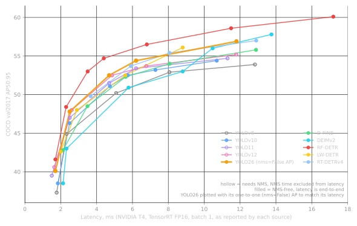

[← Back to Table of Contents](./README.md)

# Chapter 34 — YOLO Axis 8: Family Performance

> *"Every accuracy–latency plot is a set of footnotes drawn as lines. Read the footnotes first."*

## Overview

This chapter puts the modern YOLO family and its real-time DETR competitors on one accuracy–latency
plot, tier by tier, using only numbers measured on the same class of hardware (NVIDIA T4, TensorRT FP16,
batch 1) and copied from each project's own documentation (Appendix C lists every source). It then lists
what the plot cannot show: NMS time, CPU behaviour, pre-training data, fine-tuning transfer, parameter
count and licence. The interactive Atlas at the end lets you filter the same data.

The footnotes, up front
<ol style="margin:0.3rem 0 0 1rem">
<li><b>Latency is as reported by each source</b>, not re-measured. Harnesses differ (TensorRT version, timing method, input pipeline).</li>
<li><b>Hollow points need NMS and exclude it from latency.</b> YOLOv8, YOLO11 and YOLOv12 report forward-pass time only. YOLOv10, YOLO26 (<code>nms=False</code>) and the DETRs are end to end.</li>
<li><b>YOLO26 is plotted with its one-to-one head's AP</b> (40.1–56.9), because its published latency is measured with that head. Its headline AP (40.9–57.5) comes from the one-to-many head plus NMS.</li>
<li><b>Pre-training differs</b>: COCO only (v8, v10, 11, v12), Objects365 (YOLO26, LW-DETR), DINOv2 + Objects365 (RF-DETR), DINOv3 distillation (DEIMv2 S+). The plot compares recipes, not architectures.</li>
</ol>

---

## The plot

<figure>

<figcaption>COCO val2017 AP vs latency on a T4 (TensorRT FP16, batch 1), from each project's published tables. Generated by <code>tools/plot_pareto.py</code> from <code>assets/data/detectors.json</code>.</figcaption>
</figure>

Three things stand out:

1. **The Ultralytics line moved up about 3 AP at equal latency in three years.** YOLOv8n → YOLO26n
   (one-to-one) is 37.3 → 40.1 at about 1.7 ms. YOLOv8x → YOLO26x is 53.9 → 56.9 at about 12 ms.
2. **RF-DETR sits above every other curve** from about 2 ms to 17 ms, with 3–6 AP more than the YOLOs at the
   same latency. It also has the largest pre-training advantage (DINOv2 + Objects365), more parameters
   (30M even for N) and a non-permissive licence for its two largest sizes.
3. **Below 2 ms the YOLOs are still the densest cluster.** The only non-YOLO options at or under 2 ms
   are RF-DETR-Pico (41.6 AP at 1.7 ms, PML-1.0 licence) and LW-DETR-tiny (42.6 at 2.0 ms). D-FINE-N,
   DEIM-N and RF-DETR-N follow at 2.1–2.3 ms.

---

## Tier by tier

AP is COCO val2017 AP50:95. Latency is T4 TensorRT FP16 in ms. A dagger (†) means NMS is needed and
not included.

### Nano (≈ 1.5–2.5 ms)

| Model | AP | Latency | Params (M) | GFLOPs | Pre-training |
|---|---|---|---|---|---|
| DEIMv2-Pico | 38.5 | 2.13 | 1.5 | 5.2 | ImageNet |
| YOLOv8n | 37.3 | 1.77 † | 3.2 | 8.7 | COCO |
| YOLOv10-N | 38.5 | 1.84 | 2.3 | 6.7 | COCO |
| YOLO11n | 39.5 | 1.5 † | 2.6 | 6.5 | COCO |
| YOLOv12-N | 40.6 | 1.64 † | 2.6 | 6.5 | COCO |
| **YOLO26n** | **40.1** (o2o) / 40.9 (NMS) | 1.7 | 2.4 | 5.5 | Objects365 |
| RF-DETR-Pico | 41.6 | 1.7 | 8.4 | — | PE-Core-T + Objects365 |
| LW-DETR-tiny | 42.6 | 2.0 | 12.1 | 11.2 | Objects365 |
| D-FINE-N / DEIM-D-FINE-N | 42.8 / 43.0 | 2.12 | 4 | 7 | ImageNet |
| DEIMv2-N | 43.0 | 2.32 | 3.6 | 6.8 | ImageNet |
| RF-DETR-N | 48.4 | 2.3 | 30.5 | — | DINOv2 + Objects365 |

### Small (≈ 2.3–3.5 ms)

| Model | AP | Latency | Params (M) | GFLOPs |
|---|---|---|---|---|
| YOLOv8s | 44.9 | 2.33 † | 11.2 | 28.6 |
| YOLOv10-S | 46.3 | 2.49 | 7.2 | 21.6 |
| YOLO11s | 47.0 | 2.5 † | 9.4 | 21.5 |
| YOLOv12-S | 48.0 | 2.61 † | 9.3 | 21.4 |
| **YOLO26s** | **47.8** / 48.6 | 2.5 | 9.5 | 20.9 |
| LW-DETR-small | 48.0 | 2.9 | 14.6 | 16.6 |
| D-FINE-S / DEIM-S | 48.5 / 49.0 | 3.49 | 10 | 25 |
| RF-DETR-S | 53.0 | 3.5 | 32.1 | — |

### Medium (≈ 4.5–6 ms)

| Model | AP | Latency | Params (M) | GFLOPs |
|---|---|---|---|---|
| YOLOv8m | 50.2 | 5.09 † | 25.9 | 78.9 |
| YOLOv10-M | 51.1 | 4.74 | 15.4 | 59.1 |
| YOLO11m | 51.5 | 4.7 † | 20.1 | 68.0 |
| YOLOv12-M | 52.5 | 4.86 † | 20.2 | 67.5 |
| **YOLO26m** | **52.5** / 53.1 | 4.7 | 20.4 | 68.4 |
| D-FINE-M / DEIM-M | 52.3 / 52.7 | 5.62 | 19 | 57 |
| LW-DETR-medium | 52.5 | 5.6 | 28.2 | 42.8 |
| RT-DETRv4-M | 53.7 | 5.91 | — | — |
| RF-DETR-M | 54.7 | 4.4 | 33.7 | — |

### Large (≈ 6–9 ms)

| Model | AP | Latency | Params (M) | GFLOPs |
|---|---|---|---|---|
| YOLOv8l | 52.9 | 8.06 † | 43.7 | 165.2 |
| YOLOv10-L | 53.2 | 7.28 | 24.4 | 120.3 |
| YOLO11l | 53.4 | 6.2 † | 25.3 | 86.9 |
| YOLOv12-L | 53.7 | 6.77 † | 26.4 | 88.9 |
| **YOLO26l** | **54.4** / 55.0 | 6.2 | 24.8 | 86.8 |
| D-FINE-L / DEIM-L | 54.0 / 54.7 | 8.07 | 31 | 91 |
| RT-DETRv4-L | 55.4 | 8.07 | — | — |
| LW-DETR-large | 56.1 | 8.8 | 46.8 | 71.6 |
| RF-DETR-L | 56.5 | 6.8 | 33.9 | — |

### Extra-large (≈ 10–14 ms)

| Model | AP | Latency | Params (M) | GFLOPs |
|---|---|---|---|---|
| YOLOv8x | 53.9 | 12.83 † | 68.2 | 257.8 |
| YOLOv10-X | 54.4 | 10.7 | 29.5 | 160.4 |
| YOLO11x | 54.7 | 11.3 † | 56.9 | 194.9 |
| YOLOv12-X | 55.2 | 11.79 † | 59.1 | 199.0 |
| **YOLO26x** | **56.9** / 57.5 | 11.8 | 55.7 | 194.4 |
| D-FINE-X / DEIM-X | 55.8 / 56.5 | 12.89 | 62 | 202 |
| DEIMv2-L / X | 56.0 / 57.8 | 10.47 / 13.75 | 32.2 / 50.3 | 96.7 / 151.6 |
| RT-DETRv4-X | 57.0 | 12.9 | — | — |
| RF-DETR-XL | 58.6 | 11.5 | 126.4 | — |

---

## Efficiency within the Ultralytics line

At the nano scale, where most edge deployments live:

| Model | Year | AP | Params (M) | GFLOPs | AP per GFLOP | What changed (Chapter 26) |
|---|---|---|---|---|---|---|
| YOLOv5nu | 2023 | 34.3 | 2.6 | 7.7 | 4.5 | v5 backbone + v8 anchor-free head |
| YOLOv8n | 2023 | 37.3 | 3.2 | 8.7 | 4.3 | C2f, decoupled DFL head, TAL |
| YOLO11n | 2024 | 39.5 | 2.6 | 6.5 | 6.1 | C3k2, C2PSA, DW class head |
| YOLO26n (o2o) | 2026 | 40.1 | 2.4 | 5.5 | 7.3 | no DFL, dual head, MuSGD, STAL, Objects365 |

About 40% fewer FLOPs and 3 AP more from v8n to YOLO26n. Chapter 29 shows where the FLOPs went:
mostly out of the stride-8 path and the head.

---

## What the plot cannot show

### 1. NMS time

The YOLOv10 paper re-measured YOLOv8 **with** NMS on a T4: 6.16–16.86 ms, against 1.77–12.83 ms
forward only. Those NMS times come from a low confidence threshold with many candidates. At a deployment
threshold (0.25–0.5) NMS usually costs a fraction of a millisecond on GPU, more on CPU and on NPUs that
cannot run it. **For hollow points, add your own measured NMS time** (Chapter 46) before comparing them
with filled ones.

### 2. CPU behaviour

Ultralytics' own CPU ONNX numbers (Intel Xeon, ms per image):

| Scale | YOLO11 | YOLO26 (`nms=False`) | Change |
|---|---|---|---|
| n | 56.1 | **38.9** | −31% |
| s | 90.0 | **87.2** | −3% |
| m | **183.2** | 220.0 | +20% |
| l | **238.6** | 286.2 | +20% |
| x | **462.8** | 525.8 | +14% |

YOLO26's "faster on CPU" claim holds for **n** (the YOLO26 paper reports up to 43% with its own
settings) and barely for s. On these numbers, m/l/x are slower than YOLO11 on CPU. GPU ranking does not
transfer to CPU, and the same is true of NPUs (Chapter 44).

### 3. Pre-training and fine-tuning transfer

COCO AP measures one dataset. What most users need is how well a model **fine-tunes** to theirs. The
RF-DETR README reports results on RF100-VL (100 small, diverse datasets), all run in one harness:
RF-DETR-N 57.7 AP, YOLO11-N 55.3, YOLO26-N 52.0. The YOLO26-N result is *below* YOLO11-N there, the
reverse of COCO. These numbers are author-measured by a competitor and should be checked on your own
data. They do show that **COCO rank is a weak predictor of fine-tuning rank**, especially when
pre-training differs (foundation-model backbones transfer well to unusual imagery).

### 4. Parameters and memory

RF-DETR-N has 30.5M parameters for 2.3 ms; YOLO26n has 2.4M for 1.7 ms. On a GPU the large model is
fast. On a microcontroller, an NPU with 8 MB of SRAM or a mobile app with a download budget, parameter
count and activation memory decide, and the YOLO nano models win by an order of magnitude (Chapters 15,
16).

### 5. Quantisation behaviour

All of the above is FP16. INT8 changes the ranking: attention blocks, DFL heads and re-parameterised
convs lose more accuracy in INT8 than plain convs do (Chapter 45). The edge choice must be made on INT8
numbers measured on the target.

### 6. Licence

| Licence | Models |
|---|---|
| AGPL-3.0 (Ultralytics enterprise licence available) | YOLOv5/v8/v10/11/v12/v13/26/27 code and weights as released |
| GPL-3.0 | YOLOv6, YOLOv7, YOLOv9, Gold-YOLO |
| Apache-2.0 | YOLOX, PP-YOLOE, DAMO-YOLO, RTMDet, RT-DETR, D-FINE, DEIM, DEIMv2, LW-DETR, RF-DETR N–L |
| Non-permissive weights | YOLO-NAS (non-commercial weights), RF-DETR XL/2XL (PML-1.0) |

Chapter 35 explains what these licences require in practice.

---

## How to compare models for your own project

1. **Fix the hardware, runtime, precision and input size** you will deploy with.
2. **Shortlist 3–5 models** from the plot and tables at your latency budget, filtering by licence.
3. **Fine-tune each on your data** with its own default recipe and the same number of epochs (or until
   convergence), 2–3 seeds if the dataset is small.
4. **Measure end-to-end latency on the target** with post-processing included (Chapter 46), and accuracy
   with the same evaluator (Chapter 33), in the deployed precision.
5. **Decide on your metric** (recall at a threshold, AP75, false alarms per hour), not on COCO AP.

---

## Explore the data

The Detection Atlas plots every T4 TensorRT FP16 row in `detectors.json`, with filters for tier,
licence and NMS. Type "YOLO" in the search box to restrict it to the family.

---

## Key Takeaways

- On a T4 with TensorRT FP16, the Ultralytics line gained about 3 AP at equal latency from YOLOv8 to
  YOLO26. With its one-to-one AP matched to its latency, YOLO26 ties YOLOv12 at m and leads at l and x.
  At n and s, YOLOv12's NMS-excluded numbers are slightly ahead.
- RF-DETR leads COCO AP at every latency from 2 to 17 ms, with the strongest pre-training, far more
  parameters and a non-permissive licence for its largest sizes.
- Hollow points (NMS needed, not timed) are optimistic. Add measured NMS time before comparing with
  NMS-free models.
- GPU rankings do not transfer: YOLO26 is faster than YOLO11 on CPU at n, slower at m/l/x.
- COCO AP rank is a weak guide to fine-tuning rank. Shortlist from the plot, decide on your own data,
  hardware and metric.

## Check Yourself

A blog post says "YOLOv12-S beats YOLO26s: 48.0 vs 47.8 AP at almost the same latency". What is missing?

YOLOv12-S's 2.61 ms excludes NMS while YOLO26s's 2.5 ms is end to end. YOLO26s also scores 48.6 with its
one-to-many head plus NMS, which is the fair comparison to YOLOv12-S's NMS-based AP. The pre-training
also differs (COCO only vs Objects365). Matched on head and post-processing, the comparison likely
reverses.

You deploy on an Intel CPU at 640 px. Based on Ultralytics' tables, should you upgrade from YOLO11m to YOLO26m?

Not for speed: YOLO26m is listed at 220.0 ms vs 183.2 ms for YOLO11m on CPU ONNX, about 20% slower. It
is more accurate (+1.0 to +1.6 AP depending on the head). Measure both on your CPU with your export
settings. If latency is the constraint, YOLO26s or a smaller input size may be the better trade.

Why can RF-DETR-N have 30.5M parameters and still run in 2.3 ms on a T4?

GPU latency depends mainly on FLOPs at the working resolution, memory traffic and kernel efficiency,
not on parameter count. RF-DETR-N runs at a low input resolution (384) with a ViT backbone that maps
well to GPU matrix units. The parameter count matters for memory and storage, which is why the same
model is a poor fit for microcontrollers or small NPUs.

## References

| Source | Authors / Org, Year | Link | What this chapter takes from it |
|--------|--------------------|------|--------------------------------|
| `assets/data/detectors.json` (per-row sources) | this book | assets/data | Every number in the plot and tables |
| Ultralytics YOLO26 and YOLO11 model docs (`docs/macros/yolo-det-perf.md`, `docs/en/models/yolo11.md`) | Ultralytics, 2024–2026 | github.com/ultralytics/ultralytics | AP (both heads), T4 and CPU ONNX latencies |
| YOLOv10 | Wang et al., 2024 | arXiv:2405.14458 | YOLOv8 latency with and without NMS |
| YOLOv12 | Tian, Ye, Doermann, 2025 | github.com/sunsmarterjie/yolov12 | v12 table |
| D-FINE; DEIM; DEIMv2 | Peng et al., 2024; Huang et al., 2024; Huang et al., 2025 | arXiv:2410.13842; arXiv:2412.04234; arXiv:2509.20787 | DETR tables |
| RF-DETR | Robinson et al., 2025 | arXiv:2511.09554; github.com/roboflow/rf-detr | COCO and RF100-VL tables |
| LW-DETR | Chen et al., 2024 | arXiv:2406.03459 | LW-DETR table |
| RT-DETRv4 | Liao et al., 2025 | arXiv:2510.25257; github.com/RT-DETRs/RT-DETRv4 | RT-DETRv4 table |
| YOLO26 paper | Ultralytics, 2026 | arXiv:2606.03748 | CPU speed claim |

---

**Next:** [Chapter 35 — Axis 9: Ease of Use & Licensing](./35_yolo_ease_of_use_and_licensing.md) — the
axis that decides more projects than AP does.
